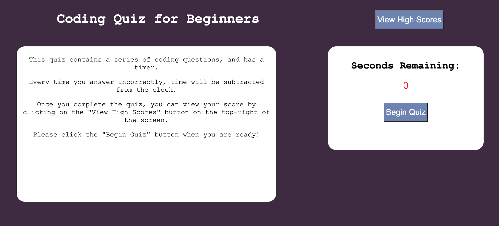

# code-quiz
Code Quiz assignment by Alvaro.

The assigment involved creating a timed quiz using javascript fundementals to store high scores to show to others. The quiz will start when pressing the start quiz button, and the timer starts. Once the timer starts, quiz questions will appear and you will have the option to choose an anwser. The saved scores should then be visible once the quiz is over. 

## Built With

* [W3 Schools Javascript](https://www.w3schools.com/js/default.asp)
* [MDN Web Docs Javascript](https://developer.mozilla.org/en-US/docs/Web/JavaScript)

* [W3 schools local Storage Property](https://www.w3schools.com/jsref/prop_win_localstorage.asp)

## Deployed Link

[Live Code for Portfolio](https://afrias40.github.io/code-quiz)

## Authors

**Alvaro Frias**: [Github](https://github.com/afrias40)

## Screenshot of Website

